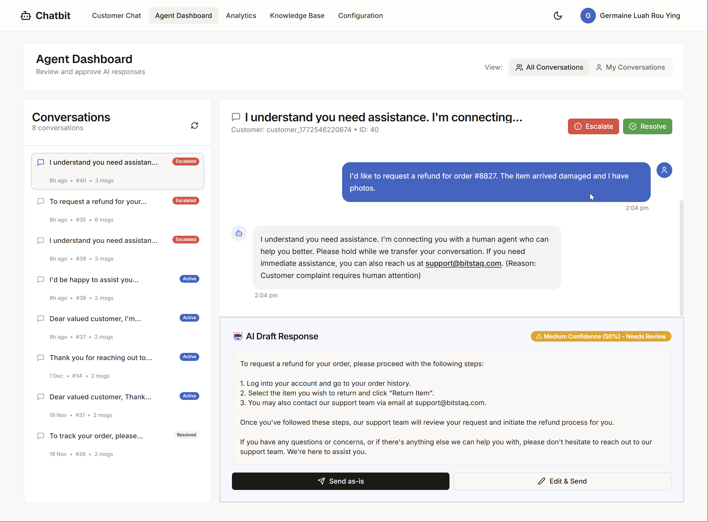
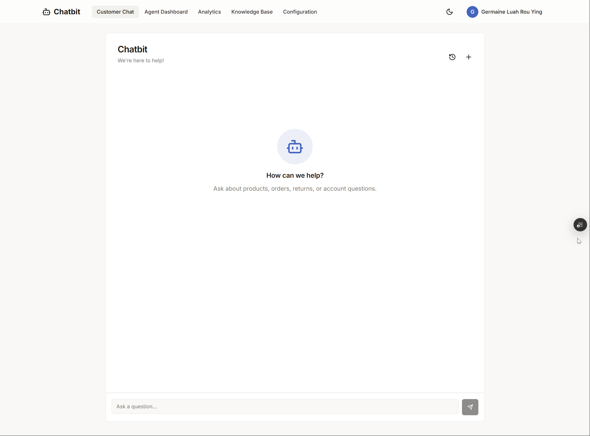
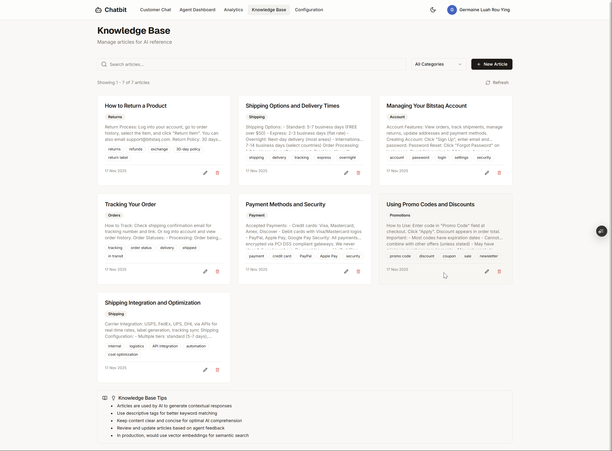
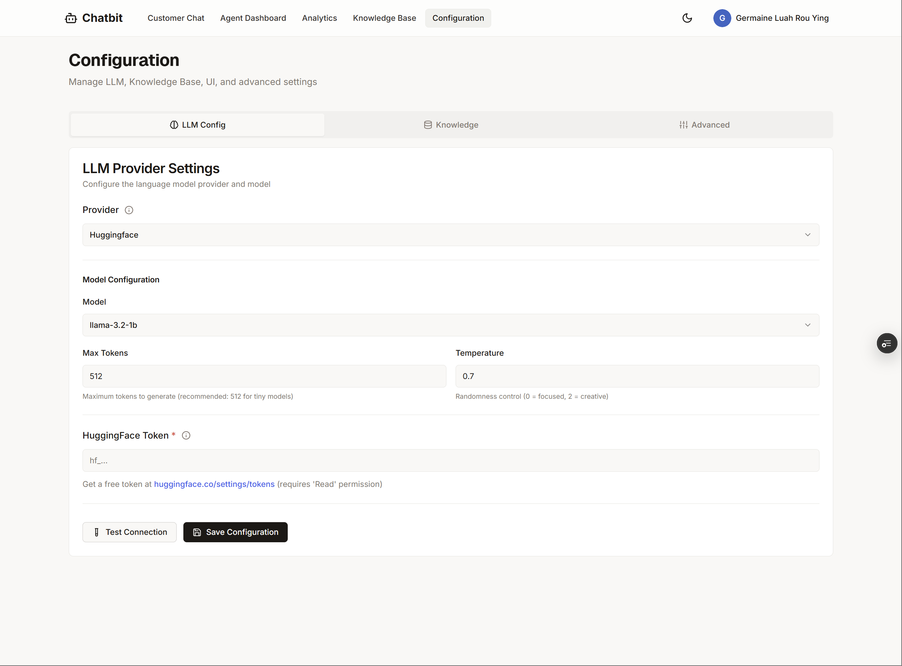
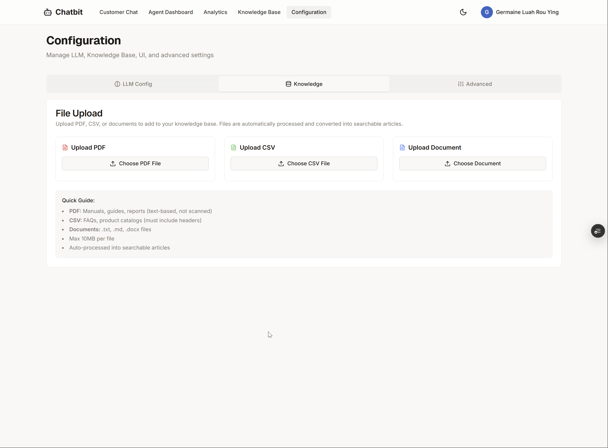
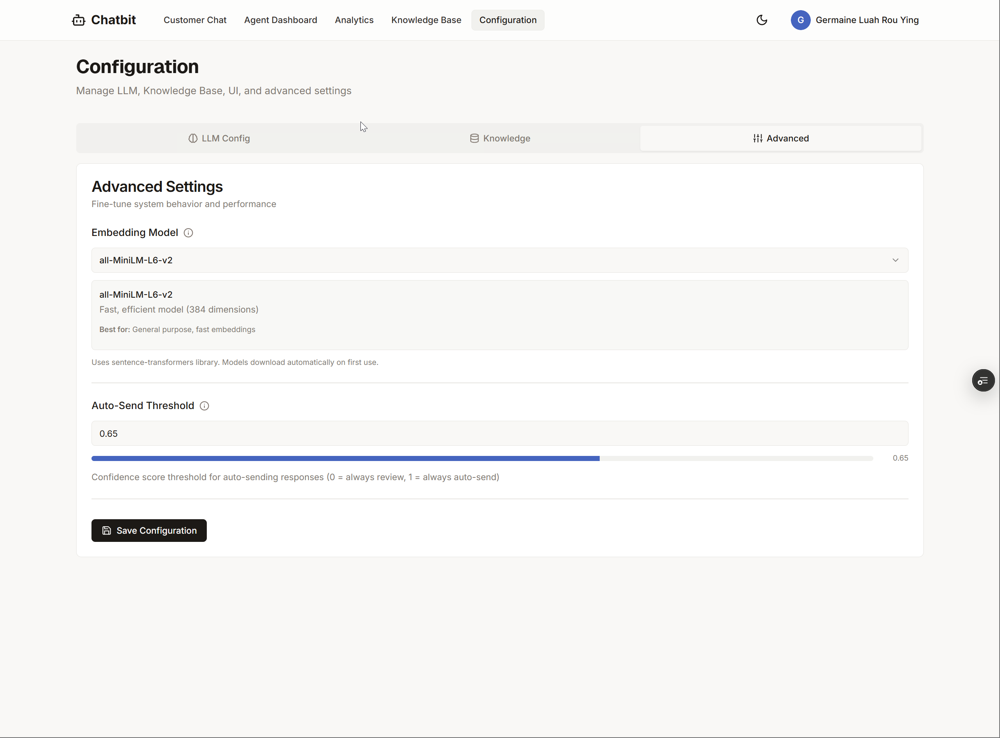

<div align="center">

# AI-Powered Customer Support Platform
### Human-in-the-Loop · RAG Knowledge Base · Agent Dashboard · Real-Time Chat

<br/>

[](https://skillicons.dev)

<br/>

> **A full-stack MVP demonstrating production-grade AI system design** — combining a RAG-powered knowledge base, human oversight workflows, prompt engineering, and a real-time agent dashboard. Built end-to-end as a solo engineering project.

<br/>



<br/>

> **Note:** This is a portfolio showcase repository. The source code is maintained in a private repository.

</div>

---

## Table of Contents

- [Overview](#overview)
- [Key Features](#key-features)
- [System Architecture](#system-architecture)
- [Tech Stack](#tech-stack)
- [Screenshots](#screenshots)
- [My Role & Engineering Decisions](#my-role--engineering-decisions)
- [Challenges & Solutions](#challenges--solutions)
- [Security & Privacy](#security--privacy)
- [Future Improvements](#future-improvements)

---

## Overview

An **end-to-end AI customer support platform** built around a Human-in-the-Loop (HITL) architecture. Every customer query goes through an AI pipeline that generates a **draft response** — a human agent reviews, edits, and approves before it reaches the customer.

The platform covers: real-time customer chat, agent draft-review dashboard, RAG-powered knowledge base, analytics, and an admin panel.

---

## Key Features

- **Human-in-the-Loop Workflow** — AI drafts every response; agents review, edit, and approve before delivery. Approvals/rejections are logged for future model improvement.
- **RAG Knowledge Base** — PDF, DOCX, and CSV uploads are chunked, embedded, and stored in ChromaDB. Top-k relevant chunks are injected into the LLM prompt at inference time.
- **Real-Time Chat** — WebSocket-backed messaging with typing indicators and connection state handling.
- **Agent Dashboard** — Conversation queue, AI draft confidence scores, and one-click approve/edit/reject actions in a single view.
- **Analytics & Metrics** — Response time, AI acceptance rates, and agent workload tracked with Recharts charts.
- **A/B Testing Framework** — Compare prompt variants and model configs; results feed a leaderboard of performing strategies.
- **Role-Based Access Control** — Three tiers (customer, agent, admin) with JWT auth and OAuth social login.
- **Document Processing Pipeline** — Uploads are parsed, chunked, embedded, and indexed automatically.

---

## System Architecture

See [`architecture.md`](./architecture.md) for a full diagram description.

### High-Level Flow

```
Customer                Agent Dashboard             Backend Services
   │                          │                           │
   │  ── sends message ──►    │                           │
   │                          │  ── POST /chat ──────►    │
   │                          │                    ┌──────┴──────┐
   │                          │                    │  RAG Engine │
   │                          │                    │  (ChromaDB) │
   │                          │                    └──────┬──────┘
   │                          │                    ┌──────┴──────┐
   │                          │                    │  LLM Layer  │
   │                          │                    │  (HF API)   │
   │                          │                    └──────┬──────┘
   │                          │  ◄── AI draft ────────────┘
   │                          │
   │                    [Agent reviews]
   │                    [edits if needed]
   │                    [approves / rejects]
   │                          │
   │  ◄── final response ─────┘
```

### Component Summary

| Layer | Responsibility |
|---|---|
| **Frontend** | React SPA — customer chat UI, agent dashboard, admin panel |
| **API Gateway** | FastAPI — REST endpoints, WebSocket hub, auth middleware |
| **RAG Engine** | ChromaDB vector store + embedding model for semantic retrieval |
| **LLM Layer** | HuggingFace Inference API — stateless, serverless LLM calls |
| **Database** | PostgreSQL (Supabase) — users, conversations, messages, feedback |
| **Storage** | Supabase Storage — knowledge base document files |
| **Auth** | JWT access tokens + bcrypt password hashing + OAuth |

---

## Tech Stack

### Backend
| Technology | Purpose |
|---|---|
| **Python 3.11 / FastAPI** | REST API and WebSocket server |
| **SQLAlchemy 2.0** | ORM with async query support |
| **PostgreSQL / Supabase** | Primary relational datastore |
| **ChromaDB** | Local vector store for RAG embeddings |
| **HuggingFace Inference API** | Serverless LLM inference (no GPU required) |
| **PyJWT / bcrypt** | Authentication and password security |
| **SlowAPI** | Rate limiting per IP and per user |
| **PyPDF2 / python-docx** | Document parsing for knowledge base ingestion |
| **uvicorn / gunicorn** | ASGI production server |

### Frontend
| Technology | Purpose |
|---|---|
| **React 18 + TypeScript** | Component UI with type safety |
| **Vite** | Fast build tooling and HMR in development |
| **Tailwind CSS + shadcn/ui** | Utility-first styling with accessible components |
| **Radix UI** | Headless, accessible UI primitives |
| **React Router v6** | Client-side routing |
| **Axios** | HTTP client with interceptors for auth |
| **Recharts** | Analytics and metrics visualisation |
| **react-markdown** | Rendered markdown in chat messages |
| **Sonner** | Toast notification system |

### Infrastructure
| Technology | Purpose |
|---|---|
| **Railway** | Cloud deployment platform |
| **Supabase** | Managed PostgreSQL + file storage |
| **Playwright** | End-to-end testing |
| **Docker** | Containerised backend deployment |

---

## Screenshots

### 1. Customer Chat Interface



---

### 2. Agent Dashboard — HITL Draft Review

Conversation queue (left) with AI draft, customer message, and approve/edit/reject controls (right).


---

### 3. Knowledge Base

Document browser with auto-indexed articles, category tags, and an AI writing tips panel.



---

### 4. Configuration — LLM Provider

Select inference provider, model, and tune parameters (max tokens, temperature) without redeployment.



---

### 5. Configuration — Knowledge Base File Upload

Upload PDFs, CSVs, and text files; they are parsed, chunked, embedded, and indexed automatically.



---

### 6. Configuration — Advanced Settings

Set the embedding model and auto-send confidence threshold (the score at which drafts bypass human review).



---

## My Role & Engineering Decisions

Solo end-to-end build — scoping, design, implementation, and deployment. Key decisions:

- **HITL over full autonomy** — Early prototypes sent AI responses directly; hallucination rate was unacceptable for customer-facing use. The HITL layer trades latency for reliability and accountability.
- **Serverless LLM inference** — HuggingFace Inference API instead of local model hosting keeps the backend within Railway's free-tier RAM limits; swapping models is a one-line config change.
- **RAG over fine-tuning** — Lets non-technical admins update the knowledge base in real time without a retraining cycle.
- **Async-first backend** — All DB queries and external calls are async (SQLAlchemy async + httpx), keeping the event loop unblocked under concurrent WebSocket load.
- **Feedback loop from day one** — Every approve/edit/reject is stored against the original draft, building a dataset ready for future fine-tuning or RLHF.

See [`case-study.md`](./case-study.md) for the full decision narrative.

---

## Challenges & Solutions

| Challenge | Solution |
|---|---|
| **Hallucinations in responses** | Strict prompt templates restrict the model to retrieved context only; HITL gate ensures no bad draft reaches a customer. |
| **RAG retrieval quality** | Tuned chunk size (256–512 tokens, 10% overlap) and added a cosine similarity threshold to exclude low-relevance chunks. |
| **Memory-constrained deployment** | Switched to HF Inference API (no local model), shrinking the Docker image from ~400 MB to ~50 MB; lazy-loaded ChromaDB and pooled PostgreSQL connections. |
| **Real-time sync across WebSockets** | In-memory connection registry backed by PostgreSQL as source of truth; clients re-fetch history on reconnect to self-heal missed events. |
| **Document ingestion failures** | Per-file validation (MIME type, size, page count) with structured error handling and status surfaced in the admin UI. |

---

## Security & Privacy

Security was treated as a first-class concern throughout development, not an afterthought.

| Area | Approach |
|---|---|
| **Authentication** | JWT access tokens with short expiry; refresh token rotation |
| **Password Storage** | bcrypt hashing — plaintext passwords never persisted |
| **Rate Limiting** | Per-IP and per-user limits via SlowAPI to prevent abuse |
| **Input Validation** | Pydantic models enforce strict typing on all API inputs |
| **File Uploads** | MIME type validation, size caps, server-side scanning before ingestion |
| **Role Enforcement** | All sensitive endpoints verify role claims from the JWT payload |
| **Secrets Management** | All credentials injected via environment variables; none hardcoded |
| **Prompt Injection** | System prompts are separated from user content; retrieved context is sanitised before injection into LLM prompts |
| **Data Isolation** | Customer conversations are scoped to their session; agents can only access assigned conversations |

---

## Future Improvements

The MVP intentionally scopes to core functionality. A production v2 would extend in these directions:

- **Streaming LLM Responses** — Stream tokens to the agent's draft panel for perceived responsiveness
- **Fine-Tuning Pipeline** — Use the accumulated approve/reject feedback dataset to fine-tune a smaller, faster model specifically for this domain
- **Multi-Tenant Architecture** — Namespace knowledge bases and conversations per organisation to support SaaS deployment
- **Automated Escalation Rules** — Allow admins to define rule-based triggers (keywords, sentiment score, wait time) for automatic escalation to senior agents
- **Voice Channel** — Add a speech-to-text ingestion path so phone/voice interactions feed into the same agent workflow
- **Observability Stack** — Integrate structured logging, distributed tracing, and an LLM-specific eval framework (e.g., LangSmith or Braintrust)
- **Mobile Agent App** — A React Native companion app for agents to review and approve drafts on the go

---

<div align="center">

**© 2025 Built by [Germaine Luah](https://github.com/germainelry)**

</div>
